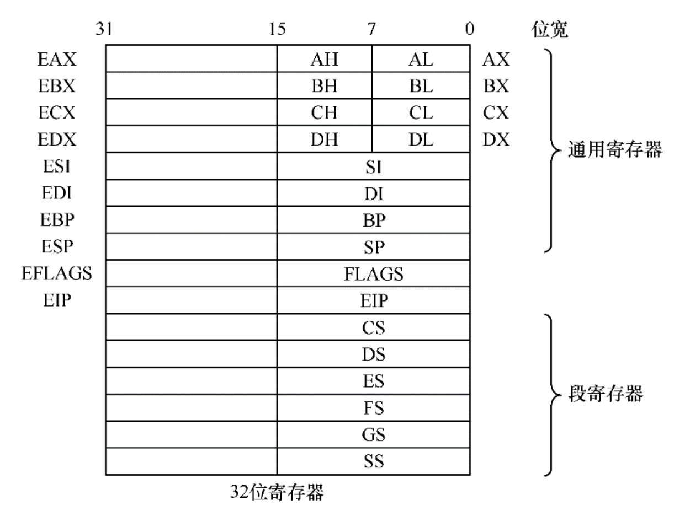
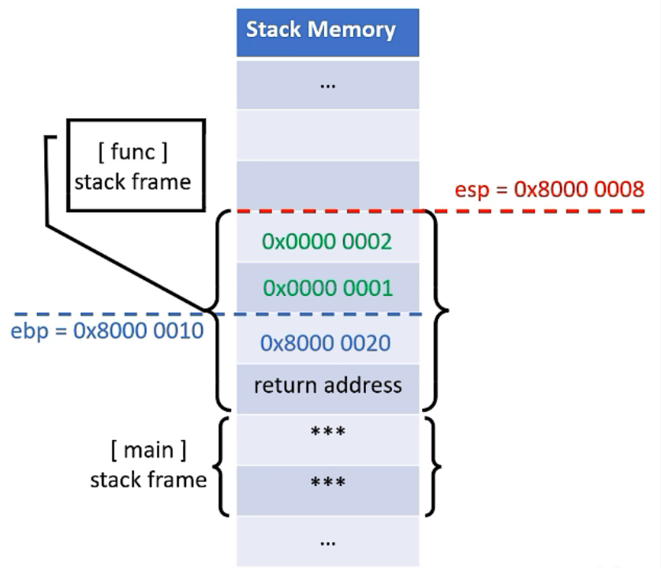
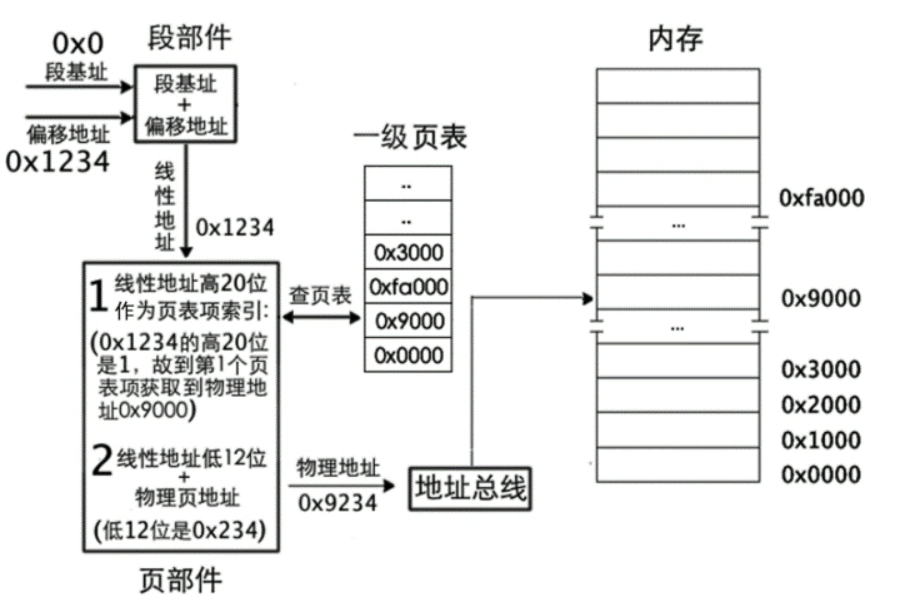
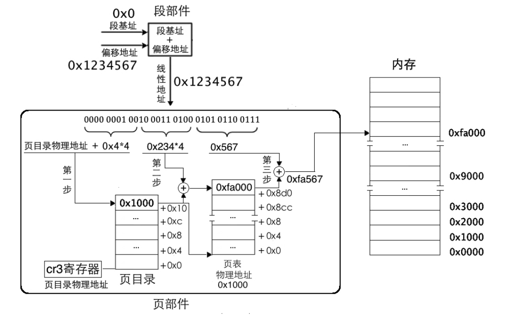

# OS开发
- 开发环境：
    - `ubuntu20.04.5 WSL`
    - `sudo apt install nasm`:安装汇编编译器 nasm
    - `sudo apt install bochs-x`:安装虚拟机 bochs
    - `sudo apt-get install qemu-system`   #下载安装可以模拟全部硬件的qemu
    - `sudo apt install gdb` 安装gdb调试器
    - `sudo apt-get install gcc-multilib`&&`sudo apt-get install g++-multilib` 安装在64位的机器上产生32位的程序

- 参考书籍:
    - 操作系统真相还原
    - 30天自制操作系统
    - Orange'S:一个操作系统的实现

**常用寄存器：**



| 16位寄存器 |      功能      | 高8位 | 低8位 |
| :--------: | :------------: | ----- | ------ |
|     AX     |   累加寄存器   | AH    | AL     |
|     CX     |   计数寄存器   | CH    | CL     |
|     DX     |   数据寄存器   | DH    | DL     |
|     BX     |   基址寄存器   | BH    | BL     |
|     SP     |  栈指针寄存器  |       |        |
|     BP     |  基指针寄存器  |       |        |
|     SI     |  源变址寄存器  |       |        |
|     DI     | 目的变址寄存器 |       |        |

- `EAX，ECX，EDX，EBX，ESP，EBP，ESI，EDI `为32位寄存器，寓意为`Extend`，在16位寄存器前加`E`。

| 段寄存器 |     功能     |
| :------: | :----------: |
|    ES    | 附件段寄存器 |
|    CS    | 代码段寄存器 |
|    SS    |  栈段寄存器  |
|    DS    | 数据段寄存器 |
|    FS    |   没有名称   |
|    GS    |   没有名称   |       

| 控制寄存器 | 名称                   | 功能             |
| ---------- | ---------------------- | ---------------- |
| cr0        |                        |                  |
| cr1        |                        |                  |
| cr2        |                        |                  |
| cr3        | 页目录基址寄存器(PBDR) | 存储页表物理地址 |
| cr4        |                        |                  |
| cr5        |                        |                  |
| cr6        |                        |                  |
| cr7        |                        |                  |

`EIP`:  指令寄存器   

 - EIP寄存器是x86架构中的一个寄存器，它存储着下一条指令的地址。EIP寄存器的全称是“Extended Instruction Pointer”，它是一个32位的寄存器，在64位的x86架构中被称为RIP寄存器。
 - 当CPU执行一条指令时，它会从EIP寄存器中读取下一条指令的地址，然后将指令的操作码加载到指令寄存器中，执行指令。当指令执行完毕时，CPU会将EIP寄存器更新为下一条指令的地址，继续执行下一条指令。    

`ESP`:  栈指针寄存器       
 - ESP寄存器是一个栈指针寄存器，用于存储堆栈的当前地址。堆栈是一个LIFO（Last In First Out）结构，它用于在程序执行期间存储临时数据。在函数调用时，参数、返回地址以及一些其他的局部变量都会被压入堆栈中。ESP寄存器的值将指向堆栈顶部，因此可以方便地访问最近的数据。
 - ESP寄存器还用于管理栈的大小。当数据被压入堆栈中时，ESP寄存器的值将减小，当数据被弹出堆栈时，ESP寄存器的值将增加。当ESP寄存器的值达到一定阈值时，将会引发栈溢出错误，这通常会导致程序崩溃。  

 `EBP`:  栈帧寄存器
 - EBP寄存器通常被用作栈帧指针，用于存储当前函数的栈帧的底部地址。栈帧是堆栈中存储当前函数的参数和局部变量的一部分，它在函数调用时动态地分配和释放。使用EBP寄存器作为栈帧指针可以方便地访问函数参数和局部变量。
 - 在函数调用时，EBP寄存器的值将被压入堆栈中，随后将EBP寄存器的值设置为当前堆栈指针的值，以便在函数执行期间可以访问函数参数和局部变量。在函数返回时，EBP寄存器的值将被弹出堆栈中，并将堆栈指针设置为EBP的值，以便恢复调用函数的堆栈指针。
 - 在汇编语言中，可以使用EBP寄存器来访问函数参数和局部变量。例如，使用"mov"指令将EBP寄存器的值复制到另一个寄存器中，然后通过指定偏移量来访问特定参数和局部变量。在C语言中，EBP寄存器被编译器用于处理函数的参数和局部变量。

**栈帧**：操作系统会为每个函数分配一段内存，这个内存就叫做栈帧，`ebp`维护栈帧栈顶位置为高地址，`esp`维护栈帧低地址，栈帧中存放着该函数的局部变量以及上一个调用函数的返回地址。访问局部变量时可以通过 [ebp + 偏移] 的方式。


## 内存映射机制
 - **一级页表取址方式**    
   一个页表项对应一个页，所以，用线性地址的高20位作为页表项的索引，每个页表项要占用4字节大小，所以这高20位的索引乘以4后才是该页表项相对于页表物理地址的字节偏移量。用cr3寄存器中的页表物理地址加上此偏移量便是该页表项的物理地址，从该页表项中得到映射的物理页地址，然后用线性地址的低12位与该物理页地址相加，所得的地址之和便是最终要访问的物理地址。
    
 - **二级页表取址方式**   
 二级页表地址转换原理是将32位虚拟地址拆分成**高10位、中间10位、低12位**三部分，它们的作用是: 高10位作为页表的索引，用于在页目录表中定位一个页目录项PDE，页目录项中有页表物理地址，也就是定位到了某个页表。中间10位作为物理页的索引，用于在页表内定位到某个页表项PTE，页表项中有分配的物理页地址，也就是定位到了某个物理页。低12位作为页内偏移量用于在已经定位到的物理页内寻址。
      

页目录存在`cr3`寄存器中   

一个页表可容纳1024个物理页，因此每个页表中表示的内存容量为：1024*4KB = 4MB

页目录中共有1024个页表，因此所有页表表示的内存容量是：1024*4MB = 4GB 


## 常用汇编指令 x86
 - `equ`: equ是nasm提供的伪指令，意为equal，即等于，指令格式为：符号名称 equ 表达式
 - `dw`：word，双字节，写入双字节即16个bit
 - `db`：bite，单字节，写入单字节即8个bit
 - `dword`: double word,四个字节，32bit
 - `org`: 伪指令，规定程序的起始地址，若不指定则程序默认从`0000h`开始         

## QEMU 命令
 - `qemu-system-i386`: 启动 x86 架构的虚拟机
 - `-s`: 是 `qemu-system-i386` 命令的一个启动选项，用于启用 `GDB` 服务器。具体来说，使用 `-s` 命令时，`QEMU` 会启动一个 `GDB` 服务器，监听本地的 `TCP` 端口号 `1234`。在使用 -s 命令启动虚拟机后，还需要使用 GDB 工具连接到 QEMU GDB 服务器。可以使用 GDB 的 target remote 命令连接到 localhost:1234，然后就可以像调试本地程序一样来调试运行在虚拟机中的程序。       
 - `-m`: 指定虚拟机的内存大小    
 - `-boot`: 指定启动时使用的引导设备
     - `-boot a` 从软盘启动
     - `-boot c` 从硬盘启动
     - `-boot d` 从 CD-ROM 启动
     - `-boot n` 从网络启动
 - `-hda`: 通常与 -boot 参数一起使用，以指定要从哪个硬盘启动
## 杂项
 - **可重定位文件和可执行文件**：在linux下`.o`和`.bin`文件都是`elf`格式。
各个符号的地址都是0，而且有的符号还是未定义的。地址为0是因为，在没有链接之前，各个可重定位文件是独立的，他们无法加载到内存中去执行，各个符号还没有进行重定位。而有的符号未定义是因为该文件中引用了外部文件的代码或者数据。    
 - **C语言内联汇编**:    
    ```c
    #define __asm__ asm  
    __asm__　__volatile__("InSTructiON List" : Output : Input : Clobber/Modify);
    //例如
    asm volatile("lgdt gdt_ptr\n");
    ```
    `volatile`是为了告诉编译器后面的代码不能被优化，直接一步步执行

## BUG记录

- 在WSL 中，grub 引导 multiboot2 的头报错

  ```sh
  # 安装 grub 
  sudo apt install grub2-common
  # 安装 xorriso 
  sudo apt-get install xorriso
  ```

  `make qemub` 报错

  ```
  Booting from Floppy...
  Boot failed: could not read the boot disk
  
  Booting from DVD/CD...
  Boot failed: Could not read from CDROM (code 0004)
  Booting from ROM...
  iPXE (PCI 00:03.0) starting execution...ok
  iPXE initializing devices...ok
  
  iPXE 1.0.0+git-20131111.c3d1e78-2ubuntu1.1 -- Open Source Network Boot Firmware
  -- http://ipxe.org
  Features: HTTP HTTPS iSCSI DNS TFTP AoE bzImage ELF MBOOT PXE Menu
  
  net0: 52:54:00:12:34:56 using 82549em on PCI00:03.0 (open)
    [Link:up, TX:0 TXE:0 RX:0 RXE:01]
  Configuring (net0 52:54:00:12:34:56)...ok
  net0: 10.0.2.15/255.255.255.0 gw 10.0.2.2
  Nothing to boot: No such file for directory (http://ipxe.org/2d03e13b)
  No more network devices
  
  No bootable device.
  ```

  > 问题解决：[qemu, "Booting from DVD/CD... Boot failed: Could not read from CDROM" · Issue #1043 · microsoft/WSL (github.com)](https://github.com/microsoft/WSL/issues/1043)
  >
  > `sudo apt-get install grub-pc-bin`

​		